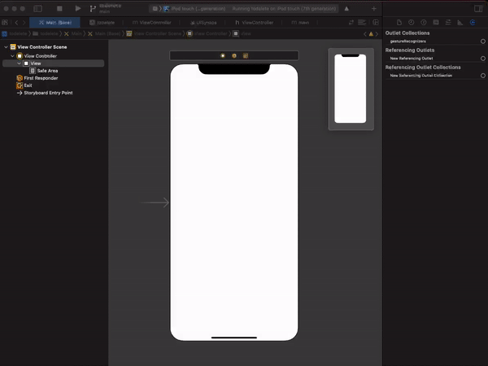
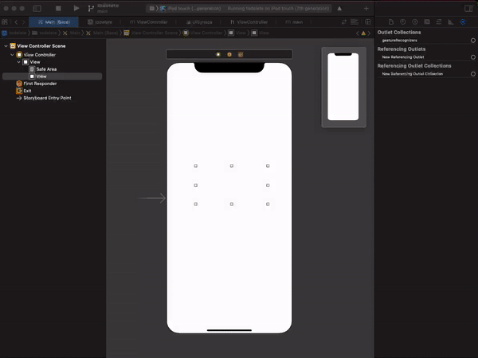
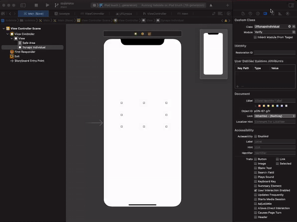
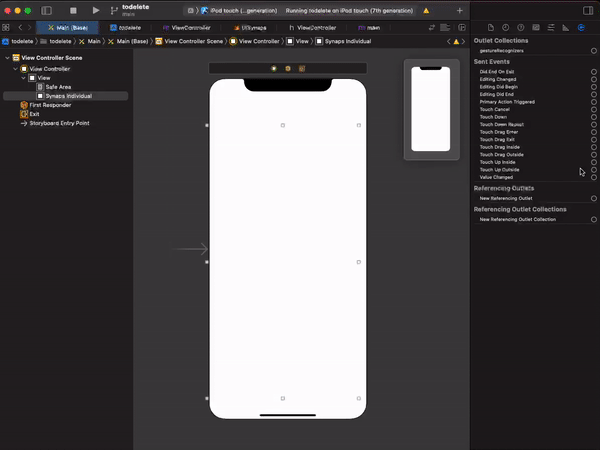

# Synaps verify

[![Swift Version][swift-image]][swift-url]
[![Build Status][travis-image]][travis-url]
[![License][license-image]][license-url]
[](https://img.shields.io/cocoapods/v/SynapsVerify.svg)
[](http://cocoapods.org/pods/SynapsVerify)
[](http://makeapullrequest.com)

**Synaps is an all-in-one compliance platform**. It offers a simple, fast and secure way to meet compliance requirements at scale.

[Visit Synaps.io](https://synaps.io) | [Read the Synaps documentation](https://docs.synaps.io)


## Installation

### CocoaPods:

```ruby
pod 'SynapsVerify'
```

### Carthage:
```
github "synaps-io/ios-verify"
```
### Swift Package Manager:

```swift
dependencies: [
    .package(url: "https://github.com/synaps-ios/ios-verify", from: "0.0.1")
]
```

## Installation
```swift
import Verify
```
## Usage
### SwiftUI
```swift
...
@State private var sessionId = ""
var body: some View {
    ...
    Synaps(sessionId: self.$sessionId, 
                   primaryColor: .blue,
                   secondaryColor: .white, ready: {
                       print("ready")
                   }, finished: {
                       print("finished")
                   })
    ...
```
### Parameters list

| Parameter name          | Parameter type                                                                                           | Default | Required | Description                                                                   |
| ------------------ | --------------------------------------------------------------------------------------------------- | ------- | -------- | ----------------------------------------------------------------------------- |
| `sessionId`        | `string`                                                                                            | `''`    | Y        | Session can be referred as a customer verification session. [More info](https://docs.synaps.io/manager-1/sessions)                                       |
| `type`          | `string`                                                                                            | `'individual'`  | N       | **individual** - for know your customer **corporate** - for know your business                   |
| `lang`      | `string`                                                                       | `'en'`  | N        | You can set a predefined language for your user. Synaps already take advantage of browser language to display the relevant language to the end-user but if your user has set up a language option to your website, you can definitely pass it as an option.|
| `tier`      | `int`                                                                       | `null`  | N        | Tier is a simply way to divide your workflow into small pieces. It is very useful when you offer different features based on the verification level of your customer.  [More info](https://docs.synaps.io/manager-1/apps/individual/tiers)                           |
| `primaryColor`      | `color`                                                                     | `null`  | N        | You can set a primary color, it will create a verification flow tailored to your compliance needs and your brand. |
| `secondaryColor`      | `color`                                                                     | `null`  | N        | You can set a secondary color, it will create a verification flow tailored to your compliance needs and your brand. |
| `ready`             | `() => void`                                                                                           | `null` | Y        | Event listener called when the page is fully loaded                                       |
| `finished`   | `() => void`                                                                                           | `null` | Y        | Event listener called when the user finished verification                     |

### StoryBoard


#### How to setup it
The library allows you to use all the features of standard View with a lot of new cool features, customizable from Storyboard or from code.


<p align="center">

</p>

First of all, drag & drop a new View inside your view controller in storyboard.

<p align="center">

</p>
Then set the View class to UISynapsIndividual or UISynapsCorporate

<p align="center">

</p>
Now you are ready to customize your UISynapsIndividual or UISynapsCorporate from the `Attributes Inspector` of Interface Builder.

`Attributes`

| Attribute name          | Attribute type                                                                                           | Default | Required | Description                                                                   |
| ------------------ | --------------------------------------------------------------------------------------------------- | ------- | -------- | ----------------------------------------------------------------------------- |
| `Lang`      | `string`                                                                       | `'en'`  | N        | You can set a predefined language for your user. Synaps already take advantage of browser language to display the relevant language to the end-user but if your user has set up a language option to your website, you can definitely pass it as an option.|
| `Tier`      | `int`                                                                       | `null`  | N        | Tier is a simply way to divide your workflow into small pieces. It is very useful when you offer different features based on the verification level of your customer.  [More info](https://docs.synaps.io/manager-1/apps/individual/tiers)                           |
| `Primary color`      | `color`                                                                     | `null`  | N        | You can set a primary color, it will create a verification flow tailored to your compliance needs and your brand. |
| `Secondary Color`      | `color`                                                                     | `null`  | N        | You can set a secondary color, it will create a verification flow tailored to your compliance needs and your brand. |
#### How to launch it

`Swift`
```swift
import Verify
import AVFoundation
class ViewController: UIViewController {
    
    @IBOutlet var synaps : UISynapsIndividual!
    override func viewDidLoad() {
        super.viewDidLoad()
        ...
    }
     func yourSessionHandler() {
        switch AVCaptureDevice.authorizationStatus(for: .video) {
            case .authorized:
            synaps.sessionId = SESSION_ID
            case .notDetermined: 
                AVCaptureDevice.requestAccess(for: .video) { granted in
                    if granted {
                        self.synaps.sessionId = SESSION_ID
                    }
                }
           ...
        }
    }
```

`Objective C`
```objc
...
#import <AVFoundation/AVFoundation.h>
...


@property (weak, nonatomic) IBOutlet UISynaps *synaps;
...
@end

@implementation ViewController


...
- (IBAction)onButtonClicked:(id)sender {
    AVAuthorizationStatus status = [AVCaptureDevice authorizationStatusForMediaType:AVMediaTypeVideo];

    if(status == AVAuthorizationStatusAuthorized) { 
        self.synaps.sessionId = SESSION_ID;
    }
    else if(status == AVAuthorizationStatusNotDetermined){ 

        [AVCaptureDevice requestAccessForMediaType:AVMediaTypeVideo completionHandler:^(BOOL granted) {
            if(granted){ 
                self.synaps.sessionId = SESSION_ID;
            } else { 
            }
        }];
    }
    ...
}

@end
```
First of all, you should set the session id. Session Id can be referred as a customer verification session. [More info](https://docs.synaps.io/manager-1/sessions)

<p align="center">

</p>

Now you are ready to listen Synaps event by listening the event `Value Changed`

`Swift`
```swift
@IBAction func onStatusChanged(sender: UISynapsIndividual) {
    if self.synaps.status == "ready" {
        ...
    } else if self.synaps.status == "finished" {
        ...
    }
}
```
`Objective C`

```objc
...
- (IBAction)onStatusChanged:(id)sender;
...
- (IBAction)onStatusChanged:(id)sender {
    if([self.synaps.status  isEqual: @"ready"]) {
        ...
    } else if ([self.synaps.status  isEqual: @"finished"]) {
        ...
    }
}
...
```
`ready`: when the page is fully loaded

`finished`: when the user finished verification
## Meta

[@synaps](https://twitter.com/synaps_id)

[https://github.com/synaps-hub/ios-verify](https://github.com/synaps-hub/ios-verify)

[swift-image]:https://img.shields.io/badge/swift-5.0-orange.svg
[swift-url]: https://swift.org/
[license-image]: https://img.shields.io/badge/License-Apache2.0-blue.svg
[license-url]: LICENSE
[travis-image]: https://img.shields.io/travis/dbader/node-datadog-metrics/master.svg?style=flat-square
[travis-url]: https://travis-ci.org/dbader/node-datadog-metrics

